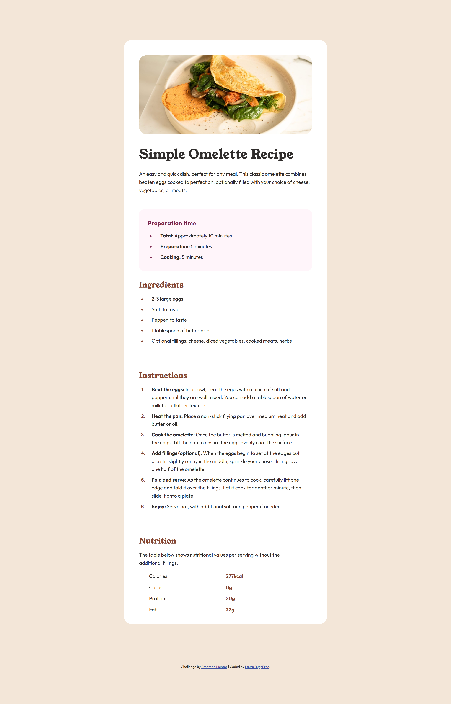
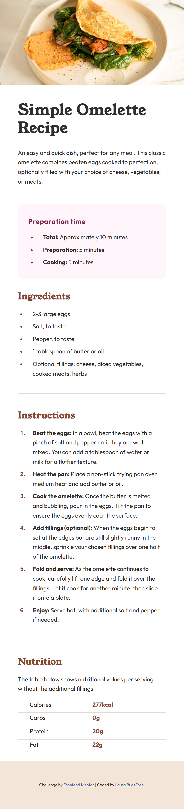

# Frontend Mentor - Recipe page solution

This is a solution to the [Recipe page challenge on Frontend Mentor](https://www.frontendmentor.io/challenges/recipe-page-KiTsR8QQKm). Frontend Mentor challenges help you improve your coding skills by building realistic projects. 

## Table of contents

- [Overview](#overview)  
  - [Screenshot](#screenshot)
  - [Links](#links)
- [My process](#my-process)
  - [Built with](#built-with)
  - [What I learned](#what-i-learned)
  - [Continued development](#continued-development)
  - [Useful resources](#useful-resources)
- [Author](#author)

## Overview

### Screenshot

### Links

- Solution URL: [Add solution URL here](https://github.com/Laura-BugFree/recipe-page-main.git)
- Live Site URL: [Add live site URL here](https://laura-bugfree.github.io/recipe-page-main/)

## My process

### Built with

- Semantic HTML5 markup
- CSS custom properties
- Flexbox
- Mobile-first workflow

### What I learned

- Tables and styling them
- learning about semantic HTML and that sometimes simplier is better
- Using ::marker to style the lists

### Continued development

- Semantic HTML, its complicated and I feel rather hard to learn.
- Keeping my CSS organized
- Knowing what HTML elements I should be using. First attempt it never aquired to me to use tables for the Nutrition section

### Useful resources

- [Markup Validation Service](https://validator.w3.org/) - This helped me check that my HTML was semantic
- [w3 schools](https://www.w3schools.com/) - explanations and examples on HTML and CSS

## Author

- Frontend Mentor - [@Laura-BugFree](https://www.frontendmentor.io/profile/Laura-Bugfree)

